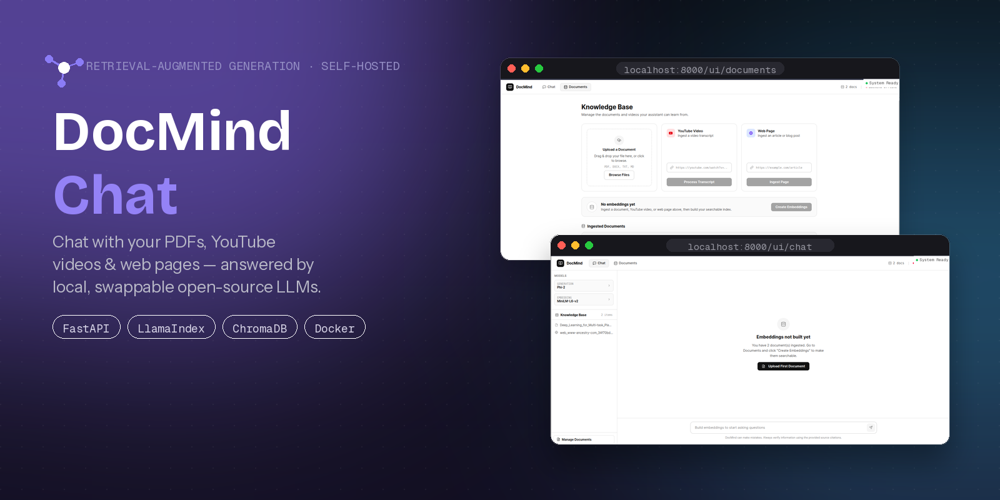
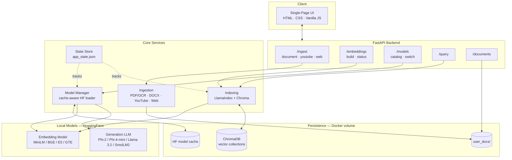
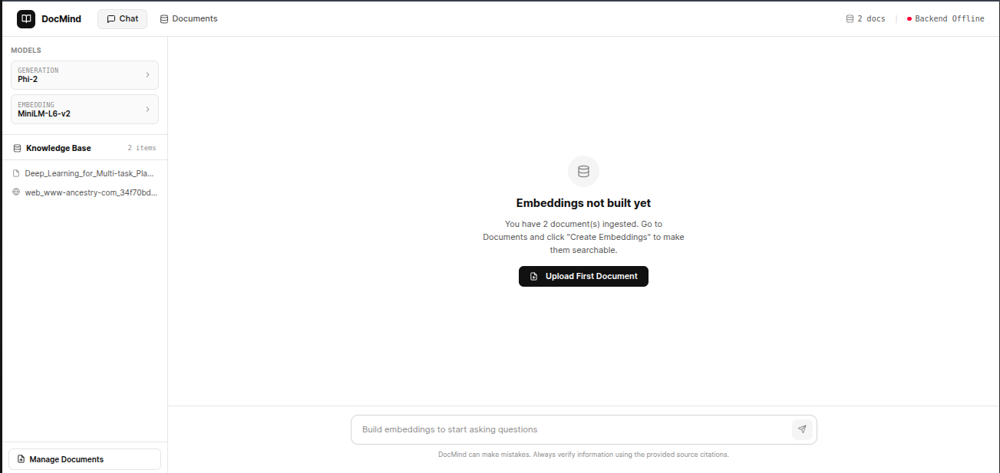
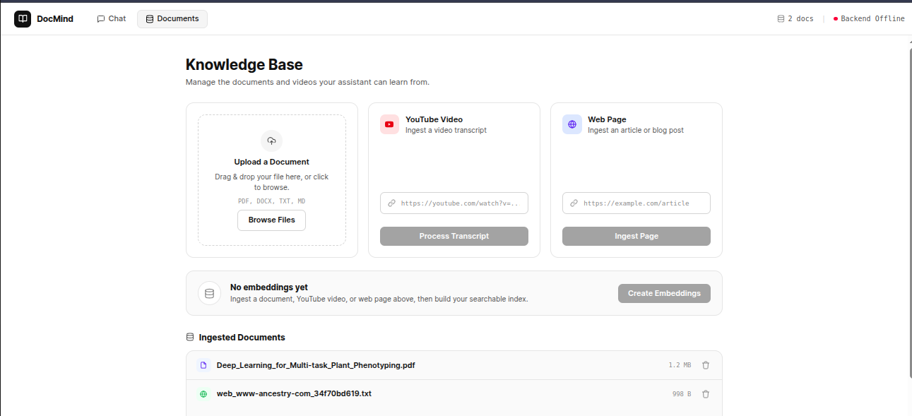

<div align="center">

# 🧠 DocMind Chat

**A self-hosted Retrieval-Augmented Generation (RAG) platform for chatting with your own documents, videos, and web pages — powered by fully local, swappable open-source LLMs.**

[](https://www.python.org/)
[](https://fastapi.tiangolo.com/)
[](https://www.llamaindex.ai/)
[](https://www.trychroma.com/)
[](https://www.docker.com/)
[](./LICENCE)



*Upload a PDF, drop in a YouTube link, or paste a web article — then ask questions and get grounded, source-cited answers, entirely offline.*

</div>

---

## Overview

DocMind Chat is a full-stack RAG application that turns unstructured content
(PDFs, Word docs, YouTube transcripts, web articles) into a queryable
knowledge base, answered by a locally-hosted LLM — no external API keys,
no data leaving your machine. It started as a single-file research
notebook and was re-engineered into a production-shaped service: a typed
FastAPI backend, a persistent vector store, and a zero-build-step frontend,
all reproducible with one `docker compose up`.

The project's core design goal was **operational clarity**: ingestion and
embedding are deliberately decoupled, every model swap is explicit and
reversible, and the index always knows whether it's in sync with what's on
disk — so the system is predictable to operate, not just to demo.

## Features

- 🔍 **Multi-source ingestion** — PDF (with OCR fallback), DOCX, TXT/Markdown, YouTube transcripts, and general web articles (boilerplate-stripped via `trafilatura`)
- 🧩 **Explicit embedding lifecycle** — ingestion just stages a source; a dedicated *Create Embeddings* step builds the index, and the UI flags when documents have changed since the last build
- 🔄 **Live model switching** — swap between 5 curated lightweight LLMs (Phi-2, Phi-4-mini, Llama 3.2 1B/3B, SmolLM2 1.7B) and 4 embedding models (MiniLM, BGE-small, E5-small, GTE-small) at runtime, no restart required
- 🗂️ **Per-model vector isolation** — each embedding model gets its own ChromaDB collection, so incompatible vector spaces never mix
- 💾 **Cache-aware model loading** — checks the local HuggingFace cache before every load and reports hit/miss in logs and the UI, so repeat runs skip re-downloading
- 🖥️ **Zero-build frontend** — a single dependency-free HTML/CSS/JS page (served by FastAPI itself) with drag-and-drop upload, a live knowledge-base status banner, and source-attributed chat
- 🐳 **One-command deploy** — Docker + Compose, with persisted volumes for documents, vectors, and model weights
- 🛠️ **Fast local iteration** — a preflight linter and a Docker-free dev runner so the edit/test loop doesn't require rebuilding an image every time

## Architecture



**Request flow:** a source is ingested and staged on disk → the user
triggers a build → LlamaIndex chunks and embeds it into the
embedding-model-specific Chroma collection → a query retrieves the
top-k chunks and passes them, with the question, to the active local LLM
→ the answer streams back to the UI with cited source chunks.

## Tech Stack

| Layer | Technology |
|---|---|
| API | FastAPI, Pydantic, Uvicorn |
| Orchestration / RAG | LlamaIndex |
| Vector store | ChromaDB (persistent, per-model collections) |
| Models | HuggingFace Transformers (local inference — Phi, Llama, SmolLM families) |
| Document parsing | pdfplumber, pytesseract (OCR fallback), python-docx, trafilatura |
| Frontend | Vanilla HTML / CSS / JS (no build step, no framework) |
| Infra | Docker, Docker Compose |

## Screenshots

<div align="center">


</div>

## Quick Start

```bash
git clone https://github.com/zubi9/DocMind-Chat.git
cd docmind-chat
cp .env.example .env
docker compose up --build
```

| | |
|---|---|
| App UI | http://localhost:8000/ui/ |
| API docs (Swagger) | http://localhost:8000/docs |

The first run downloads the default model set (~5–6 GB); everything after
that is served from the persisted `./data` volume. See `.env.example` for
tunables (model choice, retrieval top-k, gated-model tokens).

## API Overview

| Endpoint | Purpose |
|---|---|
| `POST /ingest/document` \| `/ingest/youtube` \| `/ingest/web` | Stage a source (file, transcript, or article) |
| `POST /embeddings/build` · `GET /embeddings/status` | Build/rebuild the vector index; check sync status |
| `POST /query` | Ask a question, get an answer + cited source chunks |
| `GET /documents` · `DELETE /documents/{filename}` | List / remove staged sources |
| `GET /models` · `POST /models/llm` · `POST /models/embedding` | List and switch the active models |
| `GET /health` | Liveness check |

Full request/response schemas are available at `/docs` (auto-generated
OpenAPI).

## Project Structure

```
docmind-chat/
├── app/                  # FastAPI application
│   ├── main.py           # App factory, startup lifespan, router registration
│   ├── config.py         # Environment-driven settings
│   ├── core/              # Ingestion, indexing, model management, state
│   └── routers/            # /ingest, /embeddings, /models, /query, /documents
├── frontend/
│   └── index.html        # Single-page UI, served by FastAPI at /ui
├── scripts/
│   ├── preflight_check.py  # Instant lint before a Docker build
│   └── run_local.py        # Run the app without Docker for fast iteration
├── Notebook/
│   └── RAD-RAG_pipeline.ipynb  # Original research notebook this project was built from
├── assets/                # README images
├── Dockerfile
├── docker-compose.yml
└── requirements.txt
```

## Roadmap

- [ ] Streaming token-by-token responses (SSE)
- [ ] Conversation memory / multi-turn context
- [ ] Auth layer for non-local deployment
- [ ] Hybrid (keyword + vector) retrieval

## License

See [`LICENCE`](./LICENCE).

## Acknowledgments

Built on [LlamaIndex](https://www.llamaindex.ai/), [ChromaDB](https://www.trychroma.com/),
[HuggingFace Transformers](https://huggingface.co/docs/transformers), and
[trafilatura](https://trafilatura.readthedocs.io/). Originated from an
exploratory research notebook (`Notebook/RAD-RAG_pipeline.ipynb`) and
rebuilt into this service.
