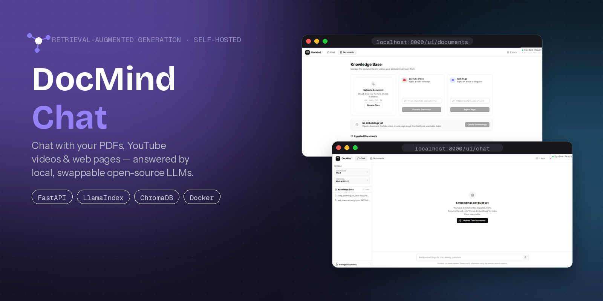
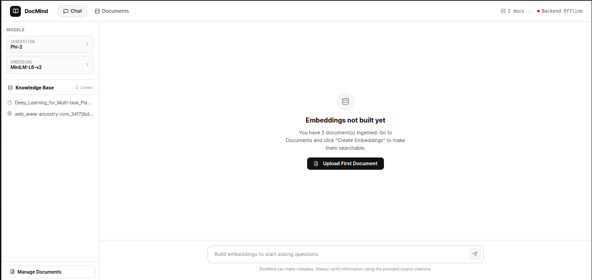
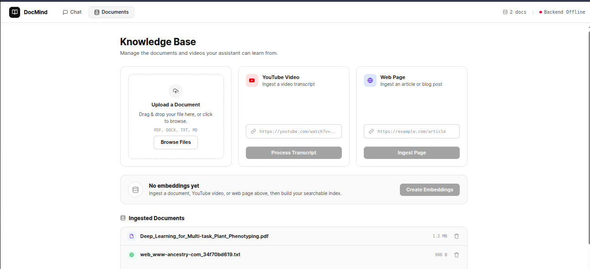

<div align="center">

# 🧠 DocMind Chat

**A self-hosted Retrieval-Augmented Generation (RAG) platform for chatting with your own documents, videos, and web pages — powered by fully local, swappable open-source LLMs.**

[](https://www.python.org/)
[](https://fastapi.tiangolo.com/)
[](https://www.llamaindex.ai/)
[](https://www.trychroma.com/)
[](https://www.docker.com/)
[](https://ollama.com/)
[](./LICENCE)



*Upload a PDF, drop in a YouTube link, or paste a web article — then ask questions and get grounded, source-cited answers, entirely offline.*

</div>

---

## Overview

DocMind Chat is a full-stack RAG application that turns unstructured content
(PDFs, Word docs, YouTube transcripts, web articles) into a queryable
knowledge base, answered by a locally-hosted LLM — no external API keys,
no data leaving your machine. It started as a single-file research
notebook and was re-engineered into a production-shaped service: a typed
FastAPI backend, a persistent vector store, and a zero-build-step frontend,
all reproducible with one `docker compose up`.

The project's core design goal was **operational clarity**: ingestion and
embedding are deliberately decoupled, every model swap is explicit and
reversible, and the index always knows whether it's in sync with what's on
disk — so the system is predictable to operate, not just to demo.

## Features

- 🔍 **Multi-source ingestion** — PDF (with OCR fallback), DOCX, TXT/Markdown, YouTube transcripts, and general web articles (boilerplate-stripped via `trafilatura`)
- 🧩 **Explicit embedding lifecycle** — ingestion just stages a source; a dedicated *Create Embeddings* step builds the index, and the UI flags when documents have changed since the last build
- 🔄 **Live model switching** — swap between curated LLMs (Mistral-7B default, plus Phi-2/Phi-4-mini, Llama 3.2 1B/3B, SmolLM2 1.7B, Qwen 2.5) and embedding models (MiniLM, BGE-small, E5-small, GTE-small, Nomic) at runtime, no restart required
- 📝 **JSON-configurable gallery** — the entire model list lives in `app/core/model_catalog.json`, not code — add, remove, or re-default a model with a JSON edit, no rebuild needed
- 🔌 **Pluggable inference backend** — same app runs on raw HuggingFace weights or on quantized GGUF via Ollama, toggled with one env var and one compose file — see [Why two backends?](#why-two-backends)
- 🗂️ **Per-model vector isolation** — each embedding model gets its own ChromaDB collection, so incompatible vector spaces never mix
- 🔀 **Hybrid retrieval** — vector similarity fused with BM25 keyword search (reciprocal rank fusion), so exact terms/names/numbers aren't lost to pure embedding similarity; degrades gracefully to vector-only if unavailable
- ✂️ **Model-aware chunking** — chunk size is capped per the active embedding model's real token limit (not a single global guess), preventing silent truncation or hard failures on smaller embedding models
- 🧹 **Response post-processing** — strips leaked chat-template tokens and trims runaway hallucinated turns before an answer reaches the UI
- 💾 **Cache-aware model loading** — checks the local HuggingFace cache before every load and reports hit/miss in logs and the UI, so repeat runs skip re-downloading
- 🖥️ **Zero-build frontend** — a single dependency-free HTML/CSS/JS page (served by FastAPI itself) with drag-and-drop upload, a live knowledge-base status banner, and source-attributed chat
- 🐳 **One-command deploy** — Docker + Compose, with persisted volumes for documents, vectors, and model weights
- 🛠️ **Fast local iteration** — a preflight linter and a Docker-free dev runner so the edit/test loop doesn't require rebuilding an image every time

## Architecture


**Request flow:** a source is ingested and staged on disk → the user
triggers a build → LlamaIndex chunks and embeds it into the
embedding-model-specific Chroma collection → a query retrieves the
top-k chunks and passes them, with the question, to the active local LLM
→ the answer streams back to the UI with cited source chunks.

## Tech Stack

| Layer | Technology |
|---|---|
| API | FastAPI, Pydantic, Uvicorn |
| Orchestration / RAG | LlamaIndex |
| Vector store | ChromaDB (persistent, per-model collections) |
| Model inference | HuggingFace Transformers **or** Ollama (quantized GGUF) — pluggable via `MODEL_BACKEND` |
| Document parsing | pdfplumber, pytesseract (OCR fallback), python-docx, trafilatura |
| Frontend | Vanilla HTML / CSS / JS (no build step, no framework) |
| Infra | Docker, Docker Compose |

## Screenshots

<div align="center">


</div>

## Quick Start

Two interchangeable backends — same app, same UI, same API, different
inference runtime under the hood.

**HuggingFace backend** (raw weights, single container):
```bash
git clone https://github.com/zubi9/DocMind-Chat.git
cd docmind-chat
cp .env.example .env
docker compose up --build
```

**Ollama backend** (quantized GGUF, lower memory footprint):
```bash
git clone https://github.com/zubi9/DocMind-Chat.git
cd docmind-chat
cp .env.example .env
docker compose -f docker-compose.ollama.yml up --build
```

| | |
|---|---|
| App UI | http://localhost:8000/ui/ |
| API docs (Swagger) | http://localhost:8000/docs |

The first run downloads/pulls the default model set; everything after
that is served from the persisted `./data` (and, for Ollama, `ollama_data`)
volumes. See `.env.example` for tunables (model choice, retrieval top-k,
gated-model tokens).

### Why two backends?

CPU inference with raw HuggingFace weights can transiently need several
GB of memory during generation — under-provisioned Docker memory limits
turn that into a silent OOM kill mid-response. The Ollama backend serves
the same model families as pre-quantized GGUF through llama.cpp, cutting
memory use roughly in half to a third for an equivalent model, at the
cost of a second container. Pick HuggingFace for simplicity and the
widest model selection (including gated Llama checkpoints); pick Ollama
for tighter memory budgets or CPU-only hosts. Both expose an identical
Model Gallery in the UI — switching backends only requires switching
which compose file you run.

This matters most for the default model: **Mistral-7B**. It's a
noticeably heavier default than the smaller options also in the gallery
(Phi-2, SmolLM2 1.7B) — budget 16GB+ container memory for the
HuggingFace backend, or lean on the Ollama backend's quantized
`mistral:7b-instruct-v0.2-q4_0` (~4.1GB) if memory is tight. Switch to
any lighter model from the Model Gallery in the UI at any time, no
restart required.

## API Overview

| Endpoint | Purpose |
|---|---|
| `POST /ingest/document` \| `/ingest/youtube` \| `/ingest/web` | Stage a source (file, transcript, or article) |
| `POST /embeddings/build` · `GET /embeddings/status` | Build/rebuild the vector index; check sync status |
| `POST /query` | Ask a question, get an answer + cited source chunks |
| `GET /documents` · `DELETE /documents/{filename}` | List / remove staged sources |
| `GET /models` · `POST /models/llm` · `POST /models/embedding` | List and switch the active models |
| `GET /eval/dataset` · `POST /eval/run` | View the evaluation golden set; run the evaluation harness |
| `GET /health` | Liveness check |

Full request/response schemas are available at `/docs` (auto-generated
OpenAPI).

## Evaluation

A self-hosted evaluation harness — deliberately not built on `ragas` or
`deepeval`, since both pull in a large dependency tree and typically
expect an OpenAI-compatible judge by default, which conflicts with this
project's whole premise of running fully local with no external API keys.
Instead it reuses infrastructure the app already has loaded in-process:
the active embedding model for semantic similarity, and optionally the
active LLM itself as a judge.

```bash
python scripts/evaluate.py                 # standard run
python scripts/evaluate.py --llm-judge      # + 1-5 faithfulness/relevance ratings (slower)
python scripts/evaluate.py --save           # also writes the full JSON report to eval_results/
```

The golden dataset lives at `data/eval_dataset.json` — inside the same
persisted volume as your documents, so it survives restarts and can be
hand-edited with no rebuild. A starter template is created automatically
on first use. Per question, you can specify any combination of:

| Field | Metric it enables |
|---|---|
| `reference_answer` | Semantic similarity (cosine, via the active embedding model) |
| `expected_sources` | Retrieval hit-rate and MRR |
| `must_include_keywords` | Keyword coverage (substring match) |

All metrics are skipped, not zeroed, for items missing the corresponding
field — a partially-filled-in dataset still produces a useful report.

## Project Structure

```
docmind-chat/
├── app/                  # FastAPI application
│   ├── main.py           # App factory, startup lifespan, router registration
│   ├── config.py         # Environment-driven settings (incl. MODEL_BACKEND)
│   ├── core/              # Ingestion, indexing, model management, state
│   │   ├── llm_setup.py       # Backend-aware model loading/switching (HF or Ollama)
│   │   ├── ollama_client.py   # Thin REST client: list/pull models on an Ollama server
│   │   ├── model_catalog.py   # Loads model_catalog.json, backend-aware accessors
│   │   ├── model_catalog.json # The actual model gallery — edit this, not the .py
│   │   ├── model_cache.py     # Backend-aware "is this model already local?" check
│   │   └── evaluation.py      # Self-hosted eval harness (retrieval, similarity, optional LLM judge)
│   └── routers/            # /ingest, /embeddings, /models, /query, /documents, /eval
├── frontend/
│   └── index.html        # Single-page UI, served by FastAPI at /ui
├── scripts/
│   ├── preflight_check.py  # Instant lint before a Docker build
│   ├── run_local.py        # Run the app without Docker (--backend huggingface|ollama)
│   └── evaluate.py         # CLI for the evaluation harness (stdlib-only, hits the live API)
├── Notebook/
│   └── RAD-RAG_pipeline.ipynb  # Original research notebook this project was built from
├── assets/                # README images
├── Dockerfile                  # HuggingFace-backend image
├── Dockerfile.ollama           # Ollama-backend image (slim, no torch/transformers)
├── docker-compose.yml          # HuggingFace-backend deployment
├── docker-compose.ollama.yml   # Ollama-backend deployment (adds an `ollama` service)
├── requirements.txt             # HuggingFace-backend dependencies
└── requirements-ollama.txt      # Ollama-backend dependencies (slim)
```

## Retrieval Quality & Roadmap

**Implemented:**
- Hybrid retrieval (vector + BM25, reciprocal rank fusion)
- Per-embedding-model chunk-size capping, driven by `max_input_tokens` in `model_catalog.json`
- Response post-processing (template-token stripping, runaway-turn trimming)
- Persisted docstore alongside Chroma, so hybrid retrieval survives a container restart without a rebuild
- Self-hosted evaluation harness (retrieval hit-rate/MRR, keyword coverage, embedding-based semantic similarity, optional local-LLM-as-judge) — see [Evaluation](#evaluation)

**Next steps, roughly in order of impact for a from-scratch RAG system:**
- **Reranking** — retrieve a wider candidate set (e.g. top 20) and rerank with a cross-encoder (`BAAI/bge-reranker-base`) or an LLM-as-judge pass before truncating to top-k. Consistently the highest-ROI retrieval upgrade; not included here to keep the Ollama-backend image free of a torch dependency — a natural next module gated behind the HuggingFace backend, or an Ollama-servable rerank model if one becomes standard.
- **Contextual chunk headers** — prepend a short LLM-generated summary of each chunk's surrounding document context before embedding (Anthropic's "contextual retrieval" pattern). Meaningfully improves recall on chunks that read as ambiguous in isolation, at the cost of one extra LLM call per chunk during the embedding build.
- **Query transformations** — HyDE (embed a hypothetical answer instead of the raw question) or multi-query expansion, both natively supported by LlamaIndex's query engine wrappers.
- **Streaming responses (SSE)** — return tokens as they generate instead of waiting for the full completion; the biggest perceived-latency win for a 7B model on modest hardware.
- **Structured metadata filtering** — surface document metadata (source type, ingested date, section) as filters in the UI, not just semantic similarity.
- **CI-integrated regression gating** — the evaluation harness above run automatically on every change, failing the build if scores drop past a threshold — the natural next step once there's a stable golden dataset.
- **Conversation memory** — multi-turn context; currently every question is independent.
- **Auth layer** — for anything beyond localhost/trusted-network deployment.

## License

See [`LICENCE`](./LICENCE).

## Acknowledgments

Built on [LlamaIndex](https://www.llamaindex.ai/), [ChromaDB](https://www.trychroma.com/),
[HuggingFace Transformers](https://huggingface.co/docs/transformers),
[Ollama](https://ollama.com/), and
[trafilatura](https://trafilatura.readthedocs.io/). Originated from an
exploratory research notebook (`Notebook/RAD-RAG_pipeline.ipynb`) and
rebuilt into this service.
